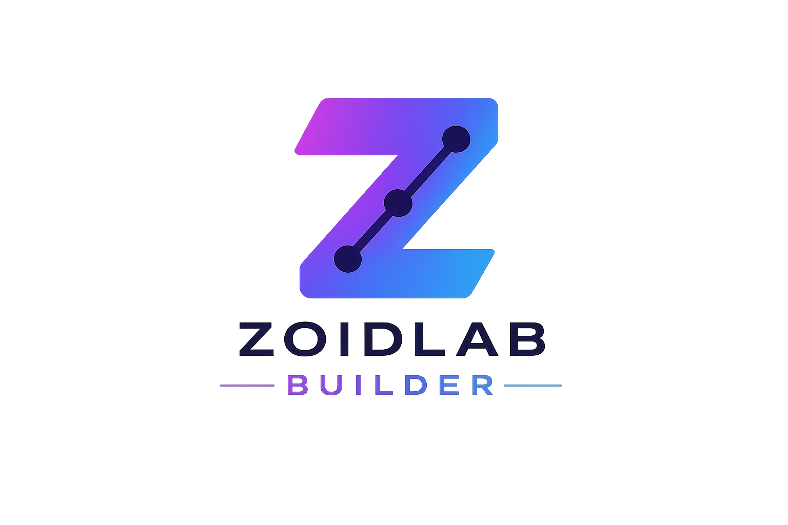

<p align="center">
  
</p>

<h1 align="center">ZoidLab · AI Workflow Builder</h1>

Visual orchestration platform for Nyquest — drag AI/logic/integration nodes onto a
canvas, connect them into a DAG, configure, run with live execution highlighting, and
(soon) deploy. Prototype vertical slice; grows into the full plan in `PLAN.md`.

## Architecture

```
zoidlab-builder/
├─ frontend/   Next.js 15 + React Flow + Zustand + Tailwind (dark Nyquest palette)
│  ├─ lib/catalog.ts   ← node types: drives the library palette AND the config panel
│  ├─ lib/store.ts     ← Zustand: nodes/edges/run status
│  └─ app/page.tsx     ← the builder (canvas + library + config + live run)
└─ backend/    FastAPI + SQLite + in-process DAG executor
   ├─ schema.py    ← the workflow JSON DAG contract
   ├─ executor.py  ← walks the graph, streams node status as SSE
   ├─ nodes.py     ← node execution + {{expression}} template engine
   └─ llm.py       ← Nyquest relay client (OpenAI-compatible)
```

**Node types (slice):** Start · Prompt · LLM (via Nyquest relay) · Decision · HTTP · End.
**Run model:** POST `/api/run` streams `{node, status}` events; the canvas highlights
nodes yellow (running) → green (complete) / red (error), with per-node output + tokens.

## Run locally

```bash
# backend
cd backend && python3 -m venv .venv && . .venv/bin/activate
pip install -r requirements.txt
cp .env.example .env          # set NYQUEST_BASE_URL + NYQUEST_API_KEY
uvicorn main:app --port 8200

# frontend (proxies /api → :8200)
cd ../frontend && npm install && npm run dev   # http://localhost:3100
```

## LLM access
Routes through the Nyquest relay (`NYQUEST_BASE_URL` = `https://api.nyquest.ai/v1`,
OpenAI-compatible). Swap the base URL + key to point at any compatible gateway.

## Deploy
Both run on **zoidberg** as systemd services (backend `:8200`, frontend `:3100`), exposed
at **builder.zoidlab.ai** via the `mcp-zoidberg` Cloudflare tunnel, behind Cloudflare Access.
